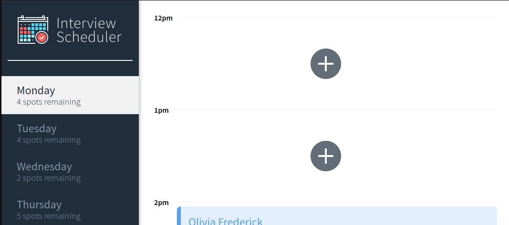

# Interview Scheduler

[](https://circleci.com/gh/mpizzaca/scheduler)


## Demo
[Live Demo on Netlify!](https://trusting-boyd-6fff97.netlify.app/) Please allow ~30s for Heroku to wake up to display the appointments.

## Description

Allows users to schedule interviews on a date/time and with an interviewer of their choice. Uses websockets to update real-time as other users book or cancel their interviews.

Fully automated testing and deployment with CircleCI and Netlify.

## Usage




## Setup

Install dependencies with `npm install`.

Requires [Interview Scheduler API](https://github.com/lighthouse-labs/scheduler-api) backend server.

## Running Webpack Development Server

```sh
npm start
```

## Running Jest Test Framework

```sh
npm test
```

## Running Cypress End-to-End Test Framework

```sh
npm run cypress
```

## Running Storybook Visual Testbed

```sh
npm run storybook
```
